# [📈 Live Status](https://uptime.botslovers.com): <!--live status--> **🟩 All systems operational**

This repository contains the open-source uptime monitor and status page for [BotsLovers SL](https://www.botslovers.com/), powered by [Upptime](https://github.com/upptime/upptime).

With [Upptime](https://upptime.js.org), you can get your own unlimited and free uptime monitor and status page, powered entirely by a GitHub repository. We use [Issues](https://github.com/Botslovers-SL/uptime/issues) as incident reports, [Actions](https://github.com/Botslovers-SL/uptime/actions) as uptime monitors, and [Pages](https://uptime.botslovers.com) for the status page.

<!--start: status pages-->
<!-- This summary is generated by Upptime (https://github.com/upptime/upptime) -->
<!-- Do not edit this manually, your changes will be overwritten -->
<!-- prettier-ignore -->
| URL | Status | History | Response Time | Uptime |
| --- | ------ | ------- | ------------- | ------ |
|  [adt](https://adt.botslovers.com) | 🟩 Up | [adt.yml](https://github.com/Botslovers-SL/uptime/commits/HEAD/history/adt.yml) | 

 617ms
     
 | 

<a href="https://uptime.botslovers.com/history/adt">98.77%</a>
    

|  [alcampo](https://alcampo.botslovers.com) | 🟩 Up | [alcampo.yml](https://github.com/Botslovers-SL/uptime/commits/HEAD/history/alcampo.yml) | 

 730ms
     
 | 

<a href="https://uptime.botslovers.com/history/alcampo">99.83%</a>
    

|  [alfares](https://alfares.botslovers.com) | 🟩 Up | [alfares.yml](https://github.com/Botslovers-SL/uptime/commits/HEAD/history/alfares.yml) | 

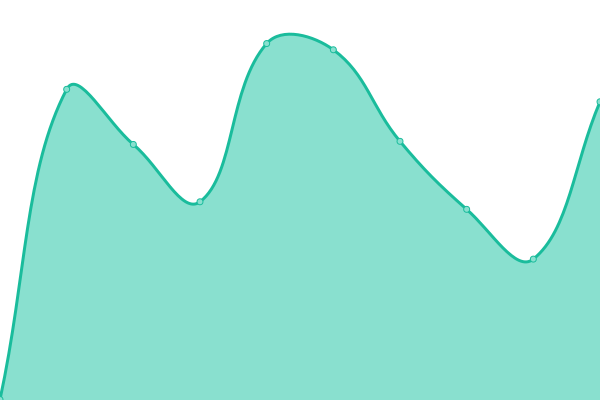 665ms
     
 | 

<a href="https://uptime.botslovers.com/history/alfares">100.00%</a>
    

|  [arajet](https://arajet.botslovers.com) | 🟩 Up | [arajet.yml](https://github.com/Botslovers-SL/uptime/commits/HEAD/history/arajet.yml) | 

 811ms
     
 | 

<a href="https://uptime.botslovers.com/history/arajet">99.33%</a>
    

|  [arthur](https://arthur.botslovers.com) | 🟩 Up | [arthur.yml](https://github.com/Botslovers-SL/uptime/commits/HEAD/history/arthur.yml) | 

 694ms
     
 | 

<a href="https://uptime.botslovers.com/history/arthur">100.00%</a>
    

|  [ascancelas](https://ascancelas.botslovers.com) | 🟩 Up | [ascancelas.yml](https://github.com/Botslovers-SL/uptime/commits/HEAD/history/ascancelas.yml) | 

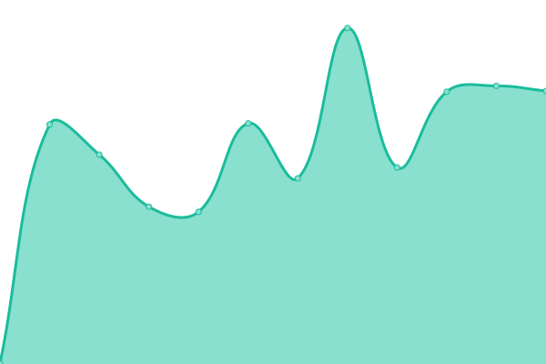 588ms
     
 | 

<a href="https://uptime.botslovers.com/history/ascancelas">100.00%</a>
    

|  [beds](https://beds.botslovers.com) | 🟩 Up | [beds.yml](https://github.com/Botslovers-SL/uptime/commits/HEAD/history/beds.yml) | 

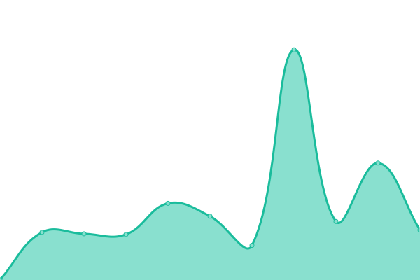 708ms
     
 | 

<a href="https://uptime.botslovers.com/history/beds">100.00%</a>
    

|  [bestway](https://bestway.botslovers.com) | 🟩 Up | [bestway.yml](https://github.com/Botslovers-SL/uptime/commits/HEAD/history/bestway.yml) | 

 777ms
     
 | 

<a href="https://uptime.botslovers.com/history/bestway">100.00%</a>
    

|  [bkool](https://bkool.botslovers.com) | 🟩 Up | [bkool.yml](https://github.com/Botslovers-SL/uptime/commits/HEAD/history/bkool.yml) | 

 699ms
     
 | 

<a href="https://uptime.botslovers.com/history/bkool">99.38%</a>
    

|  [cashconverters](https://cashconverters.botslovers.com) | 🟩 Up | [cashconverters.yml](https://github.com/Botslovers-SL/uptime/commits/HEAD/history/cashconverters.yml) | 

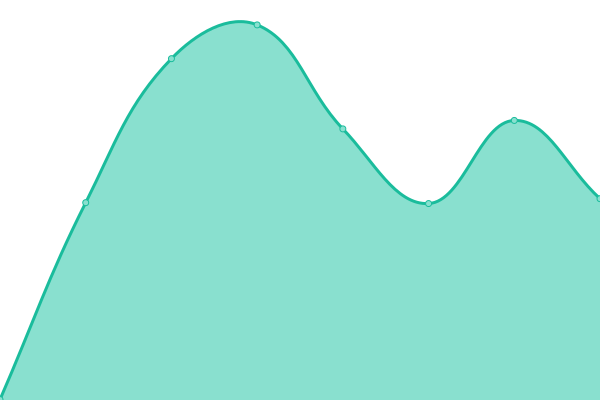 671ms
     
 | 

<a href="https://uptime.botslovers.com/history/cashconverters">99.17%</a>
    

|  [cazucar](https://cazucar.botslovers.com) | 🟩 Up | [cazucar.yml](https://github.com/Botslovers-SL/uptime/commits/HEAD/history/cazucar.yml) | 

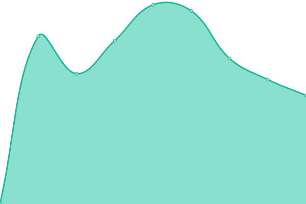 780ms
     
 | 

<a href="https://uptime.botslovers.com/history/cazucar">98.80%</a>
    

|  [centrooeste](https://centrooeste.botslovers.com) | 🟩 Up | [centrooeste.yml](https://github.com/Botslovers-SL/uptime/commits/HEAD/history/centrooeste.yml) | 

 743ms
     
 | 

<a href="https://uptime.botslovers.com/history/centrooeste">100.00%</a>
    

|  [clientesprodesa](https://clientesprodesa.botslovers.com) | 🟩 Up | [clientesprodesa.yml](https://github.com/Botslovers-SL/uptime/commits/HEAD/history/clientesprodesa.yml) | 

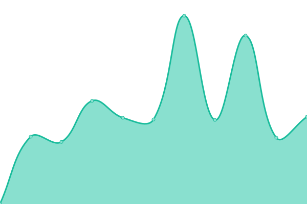 670ms
     
 | 

<a href="https://uptime.botslovers.com/history/clientesprodesa">98.87%</a>
    

|  [compas](https://compas.botslovers.com) | 🟩 Up | [compas.yml](https://github.com/Botslovers-SL/uptime/commits/HEAD/history/compas.yml) | 

 609ms
     
 | 

<a href="https://uptime.botslovers.com/history/compas">98.54%</a>
    

|  [cupra](https://cupra.botslovers.com) | 🟩 Up | [cupra.yml](https://github.com/Botslovers-SL/uptime/commits/HEAD/history/cupra.yml) | 

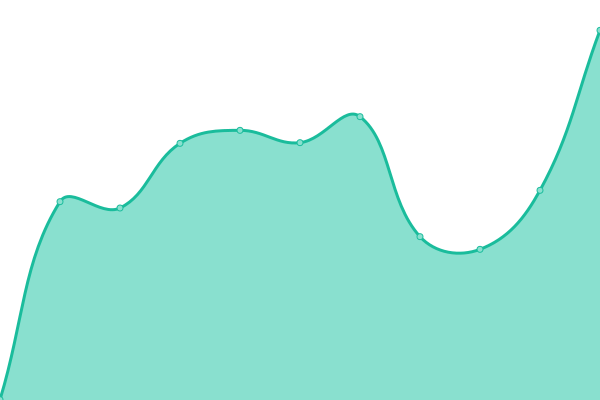 611ms
     
 | 

<a href="https://uptime.botslovers.com/history/cupra">100.00%</a>
    

|  [deluxe](https://deluxe.botslovers.com) | 🟩 Up | [deluxe.yml](https://github.com/Botslovers-SL/uptime/commits/HEAD/history/deluxe.yml) | 

 782ms
     
 | 

<a href="https://uptime.botslovers.com/history/deluxe">100.00%</a>
    

|  [demolovi](https://demolovi.botslovers.com) | 🟩 Up | [demolovi.yml](https://github.com/Botslovers-SL/uptime/commits/HEAD/history/demolovi.yml) | 

 1334ms
     
 | 

<a href="https://uptime.botslovers.com/history/demolovi">99.03%</a>
    

|  [develop](https://develop.botslovers.com) | 🟩 Up | [develop.yml](https://github.com/Botslovers-SL/uptime/commits/HEAD/history/develop.yml) | 

 621ms
     
 | 

<a href="https://uptime.botslovers.com/history/develop">100.00%</a>
    

|  [devmercadona](https://devmercadona.botslovers.com) | 🟩 Up | [devmercadona.yml](https://github.com/Botslovers-SL/uptime/commits/HEAD/history/devmercadona.yml) | 

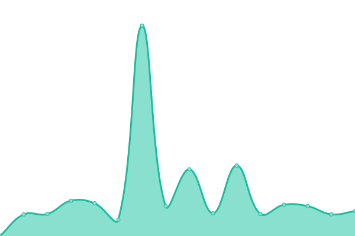 818ms
     
 | 

<a href="https://uptime.botslovers.com/history/devmercadona">98.79%</a>
    

|  [devmercadonabill](https://devmercadonabill.botslovers.com) | 🟩 Up | [devmercadonabill.yml](https://github.com/Botslovers-SL/uptime/commits/HEAD/history/devmercadonabill.yml) | 

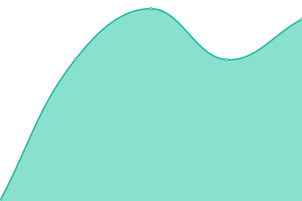 665ms
     
 | 

<a href="https://uptime.botslovers.com/history/devmercadonabill">100.00%</a>
    

|  [devticket](https://devticket.botslovers.com) | 🟩 Up | [devticket.yml](https://github.com/Botslovers-SL/uptime/commits/HEAD/history/devticket.yml) | 

 618ms
     
 | 

<a href="https://uptime.botslovers.com/history/devticket">100.00%</a>
    

|  [emprenemjunts](https://emprenemjunts.botslovers.com) | 🟩 Up | [emprenemjunts.yml](https://github.com/Botslovers-SL/uptime/commits/HEAD/history/emprenemjunts.yml) | 

 817ms
     
 | 

<a href="https://uptime.botslovers.com/history/emprenemjunts">100.00%</a>
    

|  [esmadeco](https://esmadeco.botslovers.com) | 🟩 Up | [esmadeco.yml](https://github.com/Botslovers-SL/uptime/commits/HEAD/history/esmadeco.yml) | 

 663ms
     
 | 

<a href="https://uptime.botslovers.com/history/esmadeco">100.00%</a>
    

|  [espublico](https://espublico.botslovers.com) | 🟩 Up | [espublico.yml](https://github.com/Botslovers-SL/uptime/commits/HEAD/history/espublico.yml) | 

 609ms
     
 | 

<a href="https://uptime.botslovers.com/history/espublico">100.00%</a>
    

|  [fanmallorca](https://fanmallorca.botslovers.com) | 🟩 Up | [fanmallorca.yml](https://github.com/Botslovers-SL/uptime/commits/HEAD/history/fanmallorca.yml) | 

 738ms
     
 | 

<a href="https://uptime.botslovers.com/history/fanmallorca">100.00%</a>
    

|  [fitzgerald](https://fitzgerald.botslovers.com) | 🟩 Up | [fitzgerald.yml](https://github.com/Botslovers-SL/uptime/commits/HEAD/history/fitzgerald.yml) | 

 894ms
     
 | 

<a href="https://uptime.botslovers.com/history/fitzgerald">99.52%</a>
    

|  [fresnos](https://fresnos.botslovers.com) | 🟩 Up | [fresnos.yml](https://github.com/Botslovers-SL/uptime/commits/HEAD/history/fresnos.yml) | 

 927ms
     
 | 

<a href="https://uptime.botslovers.com/history/fresnos">99.83%</a>
    

|  [healthypoke](https://healthypoke.botslovers.com) | 🟩 Up | [healthypoke.yml](https://github.com/Botslovers-SL/uptime/commits/HEAD/history/healthypoke.yml) | 

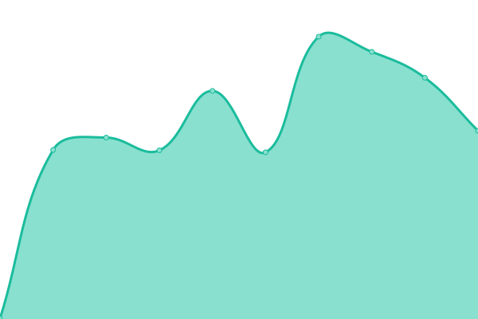 651ms
     
 | 

<a href="https://uptime.botslovers.com/history/healthypoke">100.00%</a>
    

|  [hermeneus](https://hermeneus.botslovers.com) | 🟩 Up | [hermeneus.yml](https://github.com/Botslovers-SL/uptime/commits/HEAD/history/hermeneus.yml) | 

 602ms
     
 | 

<a href="https://uptime.botslovers.com/history/hermeneus">100.00%</a>
    

|  [heytrade](https://heytrade.botslovers.com) | 🟩 Up | [heytrade.yml](https://github.com/Botslovers-SL/uptime/commits/HEAD/history/heytrade.yml) | 

 987ms
     
 | 

<a href="https://uptime.botslovers.com/history/heytrade">99.15%</a>
    

|  [holea](https://holea.botslovers.com) | 🟩 Up | [holea.yml](https://github.com/Botslovers-SL/uptime/commits/HEAD/history/holea.yml) | 

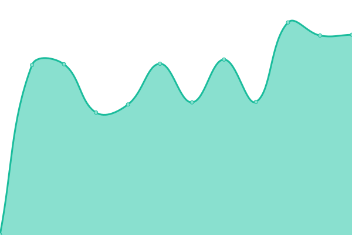 897ms
     
 | 

<a href="https://uptime.botslovers.com/history/holea">98.82%</a>
    

|  [hrsolutions](https://hrsolutions.botslovers.com) | 🟩 Up | [hrsolutions.yml](https://github.com/Botslovers-SL/uptime/commits/HEAD/history/hrsolutions.yml) | 

 691ms
     
 | 

<a href="https://uptime.botslovers.com/history/hrsolutions">99.22%</a>
    

|  [ibericomio](https://ibericomio.botslovers.com) | 🟩 Up | [ibericomio.yml](https://github.com/Botslovers-SL/uptime/commits/HEAD/history/ibericomio.yml) | 

 858ms
     
 | 

<a href="https://uptime.botslovers.com/history/ibericomio">98.52%</a>
    

|  [kuestiona](https://kuestiona.botslovers.com) | 🟩 Up | [kuestiona.yml](https://github.com/Botslovers-SL/uptime/commits/HEAD/history/kuestiona.yml) | 

 2412ms
     
 | 

<a href="https://uptime.botslovers.com/history/kuestiona">99.63%</a>
    

|  [lasrozas](https://lasrozas.botslovers.com) | 🟩 Up | [lasrozas.yml](https://github.com/Botslovers-SL/uptime/commits/HEAD/history/lasrozas.yml) | 

 826ms
     
 | 

<a href="https://uptime.botslovers.com/history/lasrozas">99.06%</a>
    

|  [maccenter](https://maccenter.botslovers.com) | 🟩 Up | [maccenter.yml](https://github.com/Botslovers-SL/uptime/commits/HEAD/history/maccenter.yml) | 

 703ms
     
 | 

<a href="https://uptime.botslovers.com/history/maccenter">98.86%</a>
    

|  [mercadona](https://mercadona.botslovers.com) | 🟩 Up | [mercadona.yml](https://github.com/Botslovers-SL/uptime/commits/HEAD/history/mercadona.yml) | 

 624ms
     
 | 

<a href="https://uptime.botslovers.com/history/mercadona">100.00%</a>
    

|  [mercadonabill](https://mercadonabill.botslovers.com) | 🟩 Up | [mercadonabill.yml](https://github.com/Botslovers-SL/uptime/commits/HEAD/history/mercadonabill.yml) | 

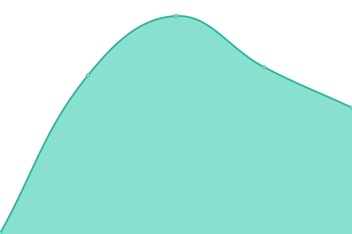 610ms
     
 | 

<a href="https://uptime.botslovers.com/history/mercadonabill">100.00%</a>
    

|  [mercadonainterno](https://mercadonainterno.botslovers.com) | 🟩 Up | [mercadonainterno.yml](https://github.com/Botslovers-SL/uptime/commits/HEAD/history/mercadonainterno.yml) | 

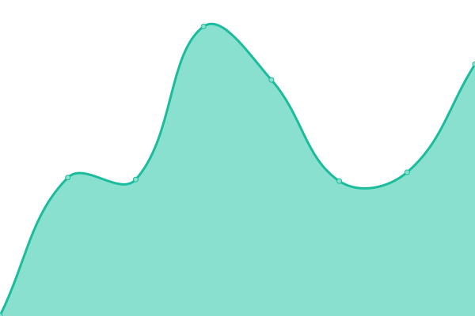 670ms
     
 | 

<a href="https://uptime.botslovers.com/history/mercadonainterno">99.80%</a>
    

|  [miniso](https://miniso.botslovers.com) | 🟩 Up | [miniso.yml](https://github.com/Botslovers-SL/uptime/commits/HEAD/history/miniso.yml) | 

 723ms
     
 | 

<a href="https://uptime.botslovers.com/history/miniso">99.63%</a>
    

|  [minisocl](https://minisocl.botslovers.com) | 🟩 Up | [minisocl.yml](https://github.com/Botslovers-SL/uptime/commits/HEAD/history/minisocl.yml) | 

 852ms
     
 | 

<a href="https://uptime.botslovers.com/history/minisocl">100.00%</a>
    

|  [notifypikolin](https://notifypikolin.botslovers.com) | 🟩 Up | [notifypikolin.yml](https://github.com/Botslovers-SL/uptime/commits/HEAD/history/notifypikolin.yml) | 

 690ms
     
 | 

<a href="https://uptime.botslovers.com/history/notifypikolin">98.69%</a>
    

|  [parqueastur](https://parqueastur.botslovers.com) | 🟩 Up | [parqueastur.yml](https://github.com/Botslovers-SL/uptime/commits/HEAD/history/parqueastur.yml) | 

 609ms
     
 | 

<a href="https://uptime.botslovers.com/history/parqueastur">100.00%</a>
    

|  [payfit](https://payfit.botslovers.com) | 🟩 Up | [payfit.yml](https://github.com/Botslovers-SL/uptime/commits/HEAD/history/payfit.yml) | 

 532ms
     
 | 

<a href="https://uptime.botslovers.com/history/payfit">58.69%</a>
    

|  [pikolin](https://pikolin.botslovers.com) | 🟩 Up | [pikolin.yml](https://github.com/Botslovers-SL/uptime/commits/HEAD/history/pikolin.yml) | 

 1342ms
     
 | 

<a href="https://uptime.botslovers.com/history/pikolin">98.82%</a>
    

|  [pikolinrecommend](https://pikolinrecommend.botslovers.com) | 🟩 Up | [pikolinrecommend.yml](https://github.com/Botslovers-SL/uptime/commits/HEAD/history/pikolinrecommend.yml) | 

 644ms
     
 | 

<a href="https://uptime.botslovers.com/history/pikolinrecommend">100.00%</a>
    

|  [plazaaluche](https://plazaaluche.botslovers.com) | 🟩 Up | [plazaaluche.yml](https://github.com/Botslovers-SL/uptime/commits/HEAD/history/plazaaluche.yml) | 

 618ms
     
 | 

<a href="https://uptime.botslovers.com/history/plazaaluche">100.00%</a>
    

|  [porsche](https://porsche.botslovers.com) | 🟩 Up | [porsche.yml](https://github.com/Botslovers-SL/uptime/commits/HEAD/history/porsche.yml) | 

 598ms
     
 | 

<a href="https://uptime.botslovers.com/history/porsche">100.00%</a>
    

|  [portalev](https://portalev.botslovers.com) | 🟩 Up | [portalev.yml](https://github.com/Botslovers-SL/uptime/commits/HEAD/history/portalev.yml) | 

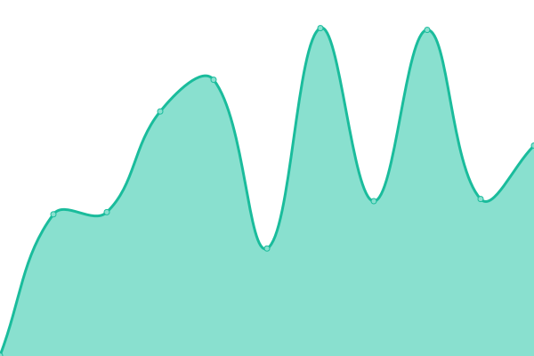 582ms
     
 | 

<a href="https://uptime.botslovers.com/history/portalev">99.34%</a>
    

|  [prodesa](https://prodesa.botslovers.com) | 🟩 Up | [prodesa.yml](https://github.com/Botslovers-SL/uptime/commits/HEAD/history/prodesa.yml) | 

 785ms
     
 | 

<a href="https://uptime.botslovers.com/history/prodesa">99.85%</a>
    

|  [proveedorespikolin](https://proveedorespikolin.botslovers.com) | 🟩 Up | [proveedorespikolin.yml](https://github.com/Botslovers-SL/uptime/commits/HEAD/history/proveedorespikolin.yml) | 

 674ms
     
 | 

<a href="https://uptime.botslovers.com/history/proveedorespikolin">99.34%</a>
    

|  [ringover](https://ringover.botslovers.com) | 🟩 Up | [ringover.yml](https://github.com/Botslovers-SL/uptime/commits/HEAD/history/ringover.yml) | 

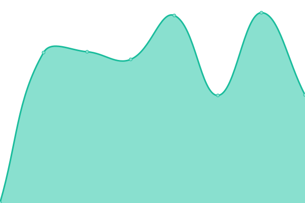 627ms
     
 | 

<a href="https://uptime.botslovers.com/history/ringover">100.00%</a>
    

|  [roca](https://roca.botslovers.com) | 🟩 Up | [roca.yml](https://github.com/Botslovers-SL/uptime/commits/HEAD/history/roca.yml) | 

 653ms
     
 | 

<a href="https://uptime.botslovers.com/history/roca">100.00%</a>
    

|  [rosaleda](https://rosaleda.botslovers.com) | 🟩 Up | [rosaleda.yml](https://github.com/Botslovers-SL/uptime/commits/HEAD/history/rosaleda.yml) | 

 686ms
     
 | 

<a href="https://uptime.botslovers.com/history/rosaleda">100.00%</a>
    

|  [sandboxzapatoferoz](https://sandboxzapatoferoz.botslovers.com) | 🟩 Up | [sandboxzapatoferoz.yml](https://github.com/Botslovers-SL/uptime/commits/HEAD/history/sandboxzapatoferoz.yml) | 

 749ms
     
 | 

<a href="https://uptime.botslovers.com/history/sandboxzapatoferoz">100.00%</a>
    

|  [siemensgbs](https://siemensgbs.botslovers.com) | 🟩 Up | [siemensgbs.yml](https://github.com/Botslovers-SL/uptime/commits/HEAD/history/siemensgbs.yml) | 

 767ms
     
 | 

<a href="https://uptime.botslovers.com/history/siemensgbs">99.22%</a>
    

|  [siemensmob](https://siemensmob.botslovers.com) | 🟩 Up | [siemensmob.yml](https://github.com/Botslovers-SL/uptime/commits/HEAD/history/siemensmob.yml) | 

 611ms
     
 | 

<a href="https://uptime.botslovers.com/history/siemensmob">100.00%</a>
    

|  [sulion](https://sulion.botslovers.com) | 🟩 Up | [sulion.yml](https://github.com/Botslovers-SL/uptime/commits/HEAD/history/sulion.yml) | 

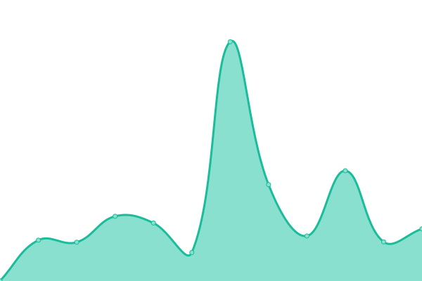 751ms
     
 | 

<a href="https://uptime.botslovers.com/history/sulion">100.00%</a>
    

|  [teka](https://teka.botslovers.com) | 🟩 Up | [teka.yml](https://github.com/Botslovers-SL/uptime/commits/HEAD/history/teka.yml) | 

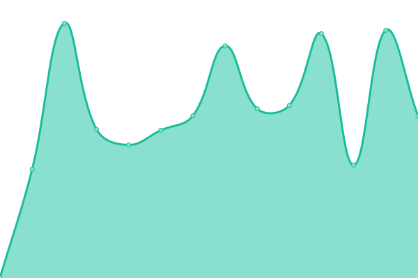 598ms
     
 | 

<a href="https://uptime.botslovers.com/history/teka">100.00%</a>
    

|  [ticketdigital](https://ticketdigital.botslovers.com) | 🟩 Up | [ticketdigital.yml](https://github.com/Botslovers-SL/uptime/commits/HEAD/history/ticketdigital.yml) | 

 806ms
     
 | 

<a href="https://uptime.botslovers.com/history/ticketdigital">98.57%</a>
    

|  [tiendaspikolin](https://tiendaspikolin.botslovers.com) | 🟩 Up | [tiendaspikolin.yml](https://github.com/Botslovers-SL/uptime/commits/HEAD/history/tiendaspikolin.yml) | 

 772ms
     
 | 

<a href="https://uptime.botslovers.com/history/tiendaspikolin">99.59%</a>
    

|  [vector](https://vector.botslovers.com) | 🟩 Up | [vector.yml](https://github.com/Botslovers-SL/uptime/commits/HEAD/history/vector.yml) | 

 633ms
     
 | 

<a href="https://uptime.botslovers.com/history/vector">98.72%</a>
    

|  [vondom](https://vondom.botslovers.com) | 🟩 Up | [vondom.yml](https://github.com/Botslovers-SL/uptime/commits/HEAD/history/vondom.yml) | 

 736ms
     
 | 

<a href="https://uptime.botslovers.com/history/vondom">98.74%</a>
    

|  [yuyocalm](https://yuyocalm.botslovers.com) | 🟩 Up | [yuyocalm.yml](https://github.com/Botslovers-SL/uptime/commits/HEAD/history/yuyocalm.yml) | 

 842ms
     
 | 

<a href="https://uptime.botslovers.com/history/yuyocalm">98.00%</a>
    

|  [zapatoferoz](https://zapatoferoz.botslovers.com) | 🟩 Up | [zapatoferoz.yml](https://github.com/Botslovers-SL/uptime/commits/HEAD/history/zapatoferoz.yml) | 

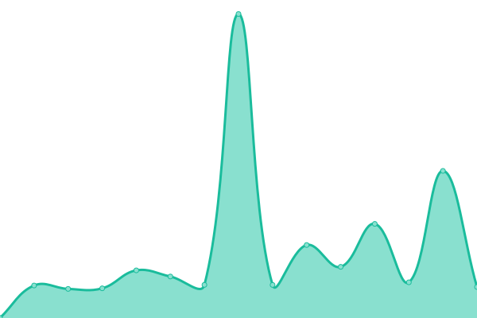 933ms
     
 | 

<a href="https://uptime.botslovers.com/history/zapatoferoz">99.81%</a>
    

|  [zirkularrak](https://zirkularrak.botslovers.com) | 🟩 Up | [zirkularrak.yml](https://github.com/Botslovers-SL/uptime/commits/HEAD/history/zirkularrak.yml) | 

 712ms
     
 | 

<a href="https://uptime.botslovers.com/history/zirkularrak">98.94%</a>
    

<!--end: status pages-->

[**Visit our status website →**](https://uptime.botslovers.com)

## 📄 License

- Powered by: [Upptime](https://github.com/upptime/upptime)
- Code: [MIT](./LICENSE) © [BotsLovers SL](https://www.botslovers.com/)
- Data in the `./history` directory: [Open Database License](https://opendatacommons.org/licenses/odbl/1-0/)
