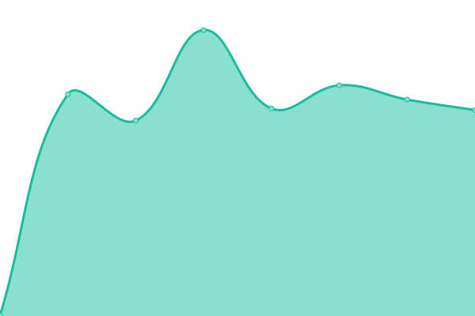

# [📈 Live Status](https://uptime.botslovers.com): <!--live status--> **🟩 All systems operational**

This repository contains the open-source uptime monitor and status page for [BotsLovers SL](https://www.botslovers.com/), powered by [Upptime](https://github.com/upptime/upptime).

With [Upptime](https://upptime.js.org), you can get your own unlimited and free uptime monitor and status page, powered entirely by a GitHub repository. We use [Issues](https://github.com/Botslovers-SL/uptime/issues) as incident reports, [Actions](https://github.com/Botslovers-SL/uptime/actions) as uptime monitors, and [Pages](https://uptime.botslovers.com) for the status page.

<!--start: status pages-->
<!-- This summary is generated by Upptime (https://github.com/upptime/upptime) -->
<!-- Do not edit this manually, your changes will be overwritten -->
<!-- prettier-ignore -->
| URL | Status | History | Response Time | Uptime |
| --- | ------ | ------- | ------------- | ------ |
|  [sandboxzapatoferoz](https://sandboxzapatoferoz.botslovers.com) | 🟩 Up | [sandboxzapatoferoz.yml](https://github.com/Botslovers-SL/uptime/commits/HEAD/history/sandboxzapatoferoz.yml) | 

 530ms
     
 | 

<a href="https://uptime.botslovers.com/history/sandboxzapatoferoz">100.00%</a>
    

|  [spell](https://spell.botslovers.com/spell/spells) | 🟩 Up | [spell.yml](https://github.com/Botslovers-SL/uptime/commits/HEAD/history/spell.yml) | 

 1181ms
     
 | 

<a href="https://uptime.botslovers.com/history/spell">99.65%</a>
    

|  [cashconverters](https://cashconverters.botslovers.com) | 🟩 Up | [cashconverters.yml](https://github.com/Botslovers-SL/uptime/commits/HEAD/history/cashconverters.yml) | 

 569ms
     
 | 

<a href="https://uptime.botslovers.com/history/cashconverters">100.00%</a>
    

|  [adt](https://adt.botslovers.com) | 🟩 Up | [adt.yml](https://github.com/Botslovers-SL/uptime/commits/HEAD/history/adt.yml) | 

 612ms
     
 | 

<a href="https://uptime.botslovers.com/history/adt">100.00%</a>
    

|  [pikolin](https://pikolin.botslovers.com) | 🟩 Up | [pikolin.yml](https://github.com/Botslovers-SL/uptime/commits/HEAD/history/pikolin.yml) | 

 522ms
     
 | 

<a href="https://uptime.botslovers.com/history/pikolin">100.00%</a>
    

|  [portalev](https://portalev.botslovers.com) | 🟩 Up | [portalev.yml](https://github.com/Botslovers-SL/uptime/commits/HEAD/history/portalev.yml) | 

 502ms
     
 | 

<a href="https://uptime.botslovers.com/history/portalev">100.00%</a>
    

|  [prodesa](https://prodesa.botslovers.com) | 🟩 Up | [prodesa.yml](https://github.com/Botslovers-SL/uptime/commits/HEAD/history/prodesa.yml) | 

 477ms
     
 | 

<a href="https://uptime.botslovers.com/history/prodesa">100.00%</a>
    

|  [healthypoke](https://healthypoke.botslovers.com) | 🟩 Up | [healthypoke.yml](https://github.com/Botslovers-SL/uptime/commits/HEAD/history/healthypoke.yml) | 

 599ms
     
 | 

<a href="https://uptime.botslovers.com/history/healthypoke">100.00%</a>
    

|  [holea](https://holea.botslovers.com) | 🟩 Up | [holea.yml](https://github.com/Botslovers-SL/uptime/commits/HEAD/history/holea.yml) | 

 581ms
     
 | 

<a href="https://uptime.botslovers.com/history/holea">100.00%</a>
    

|  [tiendaspikolin](https://tiendaspikolin.botslovers.com) | 🟩 Up | [tiendaspikolin.yml](https://github.com/Botslovers-SL/uptime/commits/HEAD/history/tiendaspikolin.yml) | 

 501ms
     
 | 

<a href="https://uptime.botslovers.com/history/tiendaspikolin">100.00%</a>
    

|  [bkool](https://bkool.botslovers.com) | 🟩 Up | [bkool.yml](https://github.com/Botslovers-SL/uptime/commits/HEAD/history/bkool.yml) | 

 485ms
     
 | 

<a href="https://uptime.botslovers.com/history/bkool">100.00%</a>
    

|  [bestway](https://bestway.botslovers.com) | 🟩 Up | [bestway.yml](https://github.com/Botslovers-SL/uptime/commits/HEAD/history/bestway.yml) | 

 522ms
     
 | 

<a href="https://uptime.botslovers.com/history/bestway">100.00%</a>
    

|  [mercadonainterno](https://mercadonainterno.botslovers.com) | 🟩 Up | [mercadonainterno.yml](https://github.com/Botslovers-SL/uptime/commits/HEAD/history/mercadonainterno.yml) | 

 474ms
     
 | 

<a href="https://uptime.botslovers.com/history/mercadonainterno">100.00%</a>
    

|  [proveedorespikolin](https://proveedorespikolin.botslovers.com) | 🟩 Up | [proveedorespikolin.yml](https://github.com/Botslovers-SL/uptime/commits/HEAD/history/proveedorespikolin.yml) | 

 516ms
     
 | 

<a href="https://uptime.botslovers.com/history/proveedorespikolin">100.00%</a>
    

|  [vondom](https://vondom.botslovers.com) | 🟩 Up | [vondom.yml](https://github.com/Botslovers-SL/uptime/commits/HEAD/history/vondom.yml) | 

 578ms
     
 | 

<a href="https://uptime.botslovers.com/history/vondom">100.00%</a>
    

|  [rosaleda](https://rosaleda.botslovers.com) | 🟩 Up | [rosaleda.yml](https://github.com/Botslovers-SL/uptime/commits/HEAD/history/rosaleda.yml) | 

 585ms
     
 | 

<a href="https://uptime.botslovers.com/history/rosaleda">100.00%</a>
    

|  [kuestiona](https://kuestiona.botslovers.com) | 🟩 Up | [kuestiona.yml](https://github.com/Botslovers-SL/uptime/commits/HEAD/history/kuestiona.yml) | 

 541ms
     
 | 

<a href="https://uptime.botslovers.com/history/kuestiona">100.00%</a>
    

|  [fitzgerald](https://fitzgerald.botslovers.com) | 🟩 Up | [fitzgerald.yml](https://github.com/Botslovers-SL/uptime/commits/HEAD/history/fitzgerald.yml) | 

 562ms
     
 | 

<a href="https://uptime.botslovers.com/history/fitzgerald">100.00%</a>
    

|  [fresnos](https://fresnos.botslovers.com) | 🟩 Up | [fresnos.yml](https://github.com/Botslovers-SL/uptime/commits/HEAD/history/fresnos.yml) | 

 574ms
     
 | 

<a href="https://uptime.botslovers.com/history/fresnos">100.00%</a>
    

|  [siemensmob](https://siemensmob.botslovers.com) | 🟩 Up | [siemensmob.yml](https://github.com/Botslovers-SL/uptime/commits/HEAD/history/siemensmob.yml) | 

 610ms
     
 | 

<a href="https://uptime.botslovers.com/history/siemensmob">100.00%</a>
    

|  [devmercadona](https://devmercadona.botslovers.com) | 🟩 Up | [devmercadona.yml](https://github.com/Botslovers-SL/uptime/commits/HEAD/history/devmercadona.yml) | 

 500ms
     
 | 

<a href="https://uptime.botslovers.com/history/devmercadona">100.00%</a>
    

|  [miniso](https://miniso.botslovers.com) | 🟩 Up | [miniso.yml](https://github.com/Botslovers-SL/uptime/commits/HEAD/history/miniso.yml) | 

 554ms
     
 | 

<a href="https://uptime.botslovers.com/history/miniso">100.00%</a>
    

|  [minisocl](https://minisocl.botslovers.com) | 🟩 Up | [minisocl.yml](https://github.com/Botslovers-SL/uptime/commits/HEAD/history/minisocl.yml) | 

 550ms
     
 | 

<a href="https://uptime.botslovers.com/history/minisocl">100.00%</a>
    

|  [beds](https://beds.botslovers.com) | 🟩 Up | [beds.yml](https://github.com/Botslovers-SL/uptime/commits/HEAD/history/beds.yml) | 

 502ms
     
 | 

<a href="https://uptime.botslovers.com/history/beds">100.00%</a>
    

|  [yuyocalm](https://yuyocalm.botslovers.com) | 🟩 Up | [yuyocalm.yml](https://github.com/Botslovers-SL/uptime/commits/HEAD/history/yuyocalm.yml) | 

 541ms
     
 | 

<a href="https://uptime.botslovers.com/history/yuyocalm">100.00%</a>
    

|  [cazucar](https://cazucar.botslovers.com) | 🟩 Up | [cazucar.yml](https://github.com/Botslovers-SL/uptime/commits/HEAD/history/cazucar.yml) | 

 543ms
     
 | 

<a href="https://uptime.botslovers.com/history/cazucar">100.00%</a>
    

|  [vector](https://vector.botslovers.com) | 🟩 Up | [vector.yml](https://github.com/Botslovers-SL/uptime/commits/HEAD/history/vector.yml) | 

 621ms
     
 | 

<a href="https://uptime.botslovers.com/history/vector">100.00%</a>
    

|  [compas](https://compas.botslovers.com) | 🟩 Up | [compas.yml](https://github.com/Botslovers-SL/uptime/commits/HEAD/history/compas.yml) | 

 479ms
     
 | 

<a href="https://uptime.botslovers.com/history/compas">100.00%</a>
    

|  [demolovi](https://demolovi.botslovers.com) | 🟩 Up | [demolovi.yml](https://github.com/Botslovers-SL/uptime/commits/HEAD/history/demolovi.yml) | 

 549ms
     
 | 

<a href="https://uptime.botslovers.com/history/demolovi">100.00%</a>
    

|  [deluxe](https://deluxe.botslovers.com) | 🟩 Up | [deluxe.yml](https://github.com/Botslovers-SL/uptime/commits/HEAD/history/deluxe.yml) | 

 552ms
     
 | 

<a href="https://uptime.botslovers.com/history/deluxe">100.00%</a>
    

|  [ascancelas](https://ascancelas.botslovers.com) | 🟩 Up | [ascancelas.yml](https://github.com/Botslovers-SL/uptime/commits/HEAD/history/ascancelas.yml) | 

 547ms
     
 | 

<a href="https://uptime.botslovers.com/history/ascancelas">100.00%</a>
    

|  [notifypikolin](https://notifypikolin.botslovers.com) | 🟩 Up | [notifypikolin.yml](https://github.com/Botslovers-SL/uptime/commits/HEAD/history/notifypikolin.yml) | 

 516ms
     
 | 

<a href="https://uptime.botslovers.com/history/notifypikolin">100.00%</a>
    

|  [facebook](https://facebook-service.botslovers.com/) | 🟩 Up | [facebook.yml](https://github.com/Botslovers-SL/uptime/commits/HEAD/history/facebook.yml) | 

 495ms
     
 | 

<a href="https://uptime.botslovers.com/history/facebook">100.00%</a>
    

|  [arthur](https://arthur.botslovers.com) | 🟩 Up | [arthur.yml](https://github.com/Botslovers-SL/uptime/commits/HEAD/history/arthur.yml) | 

 521ms
     
 | 

<a href="https://uptime.botslovers.com/history/arthur">98.92%</a>
    

|  [sulion](https://sulion.botslovers.com) | 🟩 Up | [sulion.yml](https://github.com/Botslovers-SL/uptime/commits/HEAD/history/sulion.yml) | 

 580ms
     
 | 

<a href="https://uptime.botslovers.com/history/sulion">100.00%</a>
    

|  [zirkularrak](https://zirkularrak.botslovers.com) | 🟩 Up | [zirkularrak.yml](https://github.com/Botslovers-SL/uptime/commits/HEAD/history/zirkularrak.yml) | 

 562ms
     
 | 

<a href="https://uptime.botslovers.com/history/zirkularrak">100.00%</a>
    

|  [ibericomio](https://ibericomio.botslovers.com) | 🟩 Up | [ibericomio.yml](https://github.com/Botslovers-SL/uptime/commits/HEAD/history/ibericomio.yml) | 

 581ms
     
 | 

<a href="https://uptime.botslovers.com/history/ibericomio">100.00%</a>
    

|  [arajet](https://arajet.botslovers.com) | 🟩 Up | [arajet.yml](https://github.com/Botslovers-SL/uptime/commits/HEAD/history/arajet.yml) | 

 512ms
     
 | 

<a href="https://uptime.botslovers.com/history/arajet">100.00%</a>
    

|  [ticketdigital](https://ticketdigital.botslovers.com) | 🟩 Up | [ticketdigital.yml](https://github.com/Botslovers-SL/uptime/commits/HEAD/history/ticketdigital.yml) | 

 531ms
     
 | 

<a href="https://uptime.botslovers.com/history/ticketdigital">100.00%</a>
    

|  [alfares](https://alfares.botslovers.com) | 🟩 Up | [alfares.yml](https://github.com/Botslovers-SL/uptime/commits/HEAD/history/alfares.yml) | 

 528ms
     
 | 

<a href="https://uptime.botslovers.com/history/alfares">100.00%</a>
    

|  [payfit](https://payfit.botslovers.com) | 🟩 Up | [payfit.yml](https://github.com/Botslovers-SL/uptime/commits/HEAD/history/payfit.yml) | 

 550ms
     
 | 

<a href="https://uptime.botslovers.com/history/payfit">100.00%</a>
    

|  [heytrade](https://heytrade.botslovers.com) | 🟩 Up | [heytrade.yml](https://github.com/Botslovers-SL/uptime/commits/HEAD/history/heytrade.yml) | 

 568ms
     
 | 

<a href="https://uptime.botslovers.com/history/heytrade">100.00%</a>
    

|  [hrsolutions](https://hrsolutions.botslovers.com) | 🟩 Up | [hrsolutions.yml](https://github.com/Botslovers-SL/uptime/commits/HEAD/history/hrsolutions.yml) | 

 539ms
     
 | 

<a href="https://uptime.botslovers.com/history/hrsolutions">100.00%</a>
    

|  [alcampo](https://alcampo.botslovers.com) | 🟩 Up | [alcampo.yml](https://github.com/Botslovers-SL/uptime/commits/HEAD/history/alcampo.yml) | 

 502ms
     
 | 

<a href="https://uptime.botslovers.com/history/alcampo">100.00%</a>
    

|  [siemensgbs](https://siemensgbs.botslovers.com) | 🟩 Up | [siemensgbs.yml](https://github.com/Botslovers-SL/uptime/commits/HEAD/history/siemensgbs.yml) | 

 568ms
     
 | 

<a href="https://uptime.botslovers.com/history/siemensgbs">100.00%</a>
    

|  [maccenter](https://maccenter.botslovers.com) | 🟩 Up | [maccenter.yml](https://github.com/Botslovers-SL/uptime/commits/HEAD/history/maccenter.yml) | 

 506ms
     
 | 

<a href="https://uptime.botslovers.com/history/maccenter">100.00%</a>
    

|  [emprenemjunts](https://emprenemjunts.botslovers.com) | 🟩 Up | [emprenemjunts.yml](https://github.com/Botslovers-SL/uptime/commits/HEAD/history/emprenemjunts.yml) | 

 551ms
     
 | 

<a href="https://uptime.botslovers.com/history/emprenemjunts">100.00%</a>
    

|  [mercadona](https://mercadona.botslovers.com) | 🟩 Up | [mercadona.yml](https://github.com/Botslovers-SL/uptime/commits/HEAD/history/mercadona.yml) | 

 477ms
     
 | 

<a href="https://uptime.botslovers.com/history/mercadona">100.00%</a>
    

|  [roca](https://roca.botslovers.com) | 🟩 Up | [roca.yml](https://github.com/Botslovers-SL/uptime/commits/HEAD/history/roca.yml) | 

 545ms
     
 | 

<a href="https://uptime.botslovers.com/history/roca">100.00%</a>
    

|  [fanmallorca](https://fanmallorca.botslovers.com) | 🟩 Up | [fanmallorca.yml](https://github.com/Botslovers-SL/uptime/commits/HEAD/history/fanmallorca.yml) | 

 545ms
     
 | 

<a href="https://uptime.botslovers.com/history/fanmallorca">100.00%</a>
    

|  [zapatoferoz](https://zapatoferoz.botslovers.com) | 🟩 Up | [zapatoferoz.yml](https://github.com/Botslovers-SL/uptime/commits/HEAD/history/zapatoferoz.yml) | 

 493ms
     
 | 

<a href="https://uptime.botslovers.com/history/zapatoferoz">100.00%</a>
    

|  [lasrozas](https://lasrozas.botslovers.com) | 🟩 Up | [lasrozas.yml](https://github.com/Botslovers-SL/uptime/commits/HEAD/history/lasrozas.yml) | 

 581ms
     
 | 

<a href="https://uptime.botslovers.com/history/lasrozas">100.00%</a>
    

|  [clientesprodesa](https://clientesprodesa.botslovers.com) | 🟩 Up | [clientesprodesa.yml](https://github.com/Botslovers-SL/uptime/commits/HEAD/history/clientesprodesa.yml) | 

 487ms
     
 | 

<a href="https://uptime.botslovers.com/history/clientesprodesa">100.00%</a>
    

<!--end: status pages-->

[**Visit our status website →**](https://uptime.botslovers.com)

## 📄 License

- Powered by: [Upptime](https://github.com/upptime/upptime)
- Code: [MIT](./LICENSE) © [BotsLovers SL](https://www.botslovers.com/)
- Data in the `./history` directory: [Open Database License](https://opendatacommons.org/licenses/odbl/1-0/)
